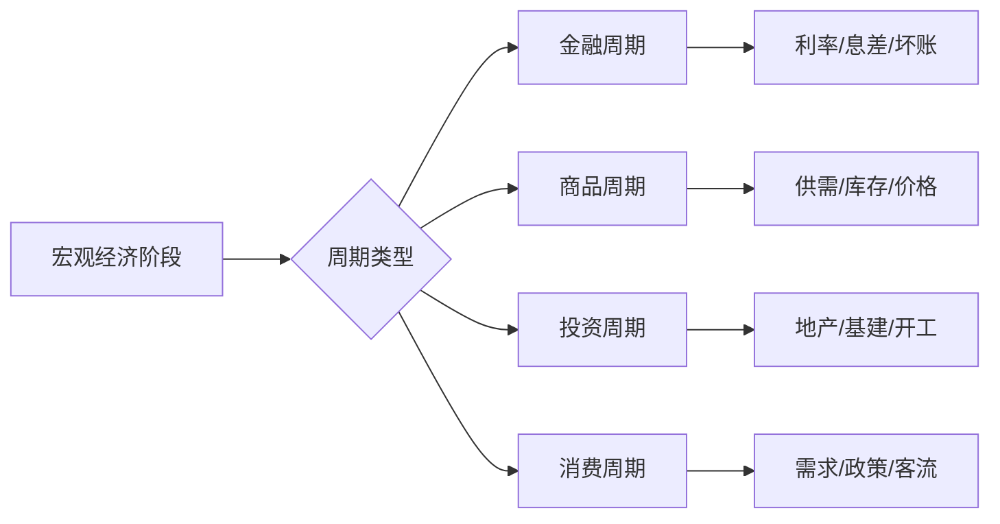

# 周期性股票观察池 (2026-03-11)

**目标**: 建立跨行业的周期股跟踪体系，观察不同经济阶段的表现

**选股原则**:
- 涵盖主要周期行业（金融、资源、基建、交运、化工、制造等）
- 行业龙头或代表性公司
- 周期性显著（业绩与宏观经济高度相关）
- 流动性好（适合大资金进出）

---

## 📋 观察池清单（6只核心标的）

| 股票 | 代码 | 行业 | 周期类型 | 当前价 | PE | PB | 评级 |
|------|------|------|----------|--------|-----|-----|------|
| 招商银行 | 600036 | 银行 | 金融周期（利率/经济） | 39.50 | 6.6 | 0.91 | 观察 |
| 紫金矿业 | 601899 | 有色 | 大宗商品周期 | 37.24 | 30.9 | 5.90 | 观察 |
| 中国神华 | 601088 | 煤炭 | 能源周期 | 47.83 | 16.2 | 2.40 | 观察 |
| 海螺水泥 | 600585 | 建材 | 投资周期（基建/地产） | 25.46 | 17.5 | 0.99 | 观察 |
| 中国国航 | 601111 | 航空 | 消费/出行周期 | ~7.0 | 负值 | ~1.5 | 观察 |
| 恒力石化 | 600346 | 化工 | 化工周期（油价/需求） | ~18 | 25-30 | ~2.0 | 观察 |

**说明**: 当前价格仅供参考，观察池侧重 **长期跟踪价值** 而非即时买入建议

---

## 一、招商银行（600036）- 金融周期代表

### 🔄 周期特征
- **周期驱动**: 宏观经济GDP增速、货币政策（利率/降准）、资产质量（坏账周期）
- **周期阶段定位**:
  - 领先指标：社融增速、M1-M2剪刀差
  - 同步指标：净息差、不良贷款率
  - 滞后指标：净利润增速、ROE
- **当前位置**: 经济弱复苏期 → 银行股处于 **估值底部**，但息差压力尚未解除

### 📊 核心观察指标
| 指标 | 当前值 | 阈值 | 意义 |
|------|--------|------|------|
| PE | 6.6倍 | <5倍（极低估）| 估值水平 |
| PB | 0.91 | <0.8（破净极致）| 资产重估 |
| 净息差 | 2.15% | >2.2%（改善）| 盈利能力 |
| 不良率 | 0.95% | <1%（安全）| 资产质量 |
| 拨备覆盖率 | 430% | >400%（充足）| 风险缓冲 |

### 🎯 操作阶段提示
- **左侧买入**：PB <0.8 或 PE <5倍（历史极端）
- **右侧加仓**：净息差企稳回升 + 不良率下降
- **止盈**：PB >1.5 或 经济过热信号

---

## 二、紫金矿业（601899）- 大宗商品周期代表

### 🔄 周期特征
- **周期驱动**: 全球供需（铜矿资本开支）、美元汇率、全球经济增速、新能源需求
- **周期阶段定位**:
  - 领先指标：铜矿CAPEX、库存周期（LME铜库存）
  - 同步指标：铜价（LME）、矿产铜产量
  - 滞后指标：矿业公司净利润、ROE
- **当前位置**: 长周期上行（新能源需求）+ 短周期震荡（美元强势）

### 📊 核心观察指标
| 指标 | 当前值 | 阈值 | 意义 |
|------|--------|------|------|
| LME铜价 | ~8,500美元 | >9,000（牛市）| 价格周期 |
| PE | 31倍 | >40（高估）| 估值水平 |
| PB | 5.9 | >7（高估）| 资产重估 |
| 资本开支 | 高速增长 | 观察增速 | 产能扩张 |
| 全球铜库存 | 低 | <20万吨（紧张）| 供需平衡 |

### 🎯 操作阶段提示
- **左侧买入**：铜价跌破 7,500 + PE <25
- **右侧加仓**：铜价突破 9,000 + 库存持续下降
- **止盈**：铜价 >10,000 或 PE >50（泡沫期）

---

## 三、中国神华（601088）- 能源周期代表

### 🔄 周期特征
- **周期驱动**: 煤炭价格（动力煤）、电力需求、煤炭政策（长协价）、能源转型节奏
- **周期阶段定位**:
  - 领先指标：电厂库存、煤炭海运价格
  - 同步指标：动力煤价格（秦港5500）、火电发电量
  - 滞后指标：煤炭企业净利润、分红率
- **当前位置**: 煤价企稳，但长期下行压力（新能源替代）

### 📊 核心观察指标
| 指标 | 当前值 | 阈值 | 意义 |
|------|--------|------|------|
| 秦港5500煤价 | ~800元 | >900（强周期）| 价格周期 |
| PE | 16.2 | >25（高估）| 估值水平 |
| PB | 2.4 | >3.0（高估）| 资产重估 |
| 股息率 | 4.5% | >6%（极值）| 收息价值 |
| 发电量增速 | 小幅正 | >5%（强需求）| 需求端 |

### 🎯 操作阶段提示
- **左侧买入**：煤价 <700 或 股息率 >6%
- **右侧加仓**：煤价 >850 + 库存下降
- **止盈**：煤价 >1,000 或 PB >3.5（估值顶部）

---

## 四、海螺水泥（600585）- 投资周期代表

### 🔄 周期特征
- **周期驱动**: 房地产新开工、基建投资增速、水泥产量、供给侧改革政策
- **周期阶段定位**:
  - 领先指标：地产销量、M1增速、专项债发行
  - 同步指标：水泥价格（PO42.5）、庫存容比
  - 滞后指标：水泥企业毛利率、ROE
- **当前位置**: 地产深度调整期，需求底部震荡，政策博弈阶段

### 📊 核心观察指标
| 指标 | 当前值 | 阈值 | 意义 |
|------|--------|------|------|
| 水泥价格指数 | ~380 | >450（景气）| 价格周期 |
| PE | 17.5 | >30（高估）| 估值水平 |
| PB | 0.99 | >1.5（修复）| 资产重估 |
| 地产新开工面积 | -20% YoY | 转正（复苏）| 需求端 |
| 庫存容比 | 65% | <50%（紧）| 供需平衡 |

### 🎯 操作阶段提示
- **左侧买入**: PB <0.8 或 新开工面积接近转正
- **右侧加仓**: 水泥价格指数 >420 + 庫存 <55%
- **止盈**: 价格指数 >480 或 PB >1.8

---

## 五、中国国航（601111）- 消费/出行周期代表

### 🔄 周期特征
- **周期驱动**: 航空需求（旅客周转量）、油价、汇率、航线政策、突发事件（疫情）
- **周期阶段定位**:
  - 领先指标： passenger demand forecasts、航线审批、出境游政策
  - 同步指标：RPK（旅客周转量）、ASK（可用座公里）、客座率
  - 滞后指标：单位ASK收入、净利润
- **当前位置**: 后疫情复苏期，但内需疲软、国际航线恢复慢

### 📊 核心观察指标
| 指标 | 当前值 | 阈值 | 意义 |
|------|--------|------|------|
| 客座率 | ~75% | >80%（满舱）| 需求强度 |
| PE | 负值（亏损）| 转正（盈利）| 周期拐点 |
| PB | ~1.5 | <1.0（底部）| 资产重估 |
| 油价（布伦特） | ~80美元 | >100（压力）| 成本端 |
| 人民币汇率 | 7.2 | 贬值压力 | 汇兑损益 |

### 🎯 操作阶段提示
- **左侧买入**: 客座率 >80% + 连续两季盈利
- **右侧加仓**: RPk增速 >10% + 油价 <70
- **止盈**: 周期顶点（需求饱和 + 高油价）

---

## 六、恒力石化（600346）- 化工周期代表

### 🔄 周期特征
- **周期驱动**: 原油价格、化工品需求（纺织/地产/汽车）、产能周期、关税政策
- **周期阶段定位**:
  - 领先指标：油价（WTI）、化工品期货价格、 PMI新订单
  - 同步指标：PX/PTA/乙烯价格、价差（利润空间）
  - 滞后指标：炼化企业毛利率、ROE
- **当前位置**: 油价震荡，化工品需求弱复苏，产能过剩压力

### 📊 核心观察指标
| 指标 | 当前值 | 阈值 | 意义 |
|------|--------|------|------|
| WTI油价 | ~75美元 | >90（高周期）| 成本驱动 |
| PE | 25-30倍 | >40（高估）| 估值水平 |
| PB | ~2.0 | >3.0（高估）| 资产重估 |
| PX-石脑油价差 | ~400美元 | >500（高利润）| 盈利空间 |
| 化工品库存 | 中高位 | <30%（去库）| 供需平衡 |

### 🎯 操作阶段提示
- **左侧买入**: 油价 >90 + 价差 >600
- **右侧加仓**: 库存快速下降 + 需求回暖
- **止盈**: 价差 <200（利润压缩）或新产能大规模投放

---

## 📈 周期股通用跟踪框架

### 1️⃣ 宏观定位（自上而下）


**四阶段模型**:
1. **衰退期**: 低增长、低通胀 → 持有防御性金融（银行低估值）
2. **复苏期**: 增长回升、通胀低位 → 配置金融+有色+交运
3. **过热期**: 高增长、高通胀 → 配置资源（煤/铜/油）+ 化工
4. **滞胀期**: 低增长、高通胀 → 持有现金，减仓周期

### 2️⃣ 行业跟踪（中观层面）
- **领先指标**: 政策变化、库存周期、产能周期
- **同步指标**: 价格、销量、开工率
- **滞后指标**: 企业盈利、ROE

### 3️⃣ 个股筛选（微观层面）
- **龙头优先**: 市占率高、成本优势、现金流好
- **安全边际**: PB/PE处于历史30%分位以下
- **分红能力**: 连续分红、分红率稳定

---

## 🎯 使用指南

### 如何维护观察池？
1. **每日**: 更新价格、关键指标
2. **每周**: 跟踪行业新闻、政策变化
3. **每月**: 复盘宏观数据（PMI、社融、通胀）
4. **每季**: 阅读公司财报，评估业绩是否符合预期

### 何时发出买入信号？
综合评分系统（示例）:
| 评分项 | 权重 | 说明 |
|--------|------|------|
| 宏观周期位置 | 30% | 衰退末期/复苏初期最佳 |
| 行业估值 | 25% | PE/PB历史分位 <30% |
| 个股安全边际 | 20% | PB <1 或 PE <历史30%分位 |
| 技术形态 | 15% | 突破关键均线、量能放大 |
| 资金流向 | 10% | 北向资金/主力资金净流入 |

**买入阈值**: 综合评分 >70分（满分100）

### 何时止盈/止损？
- **止损**: 宏观周期逆转 + 个股基本面恶化
- **止盈**: 估值达到历史70%分位 + 技术过热信号

---

## 📊 当前市场周期定位（2026-03-11）

| 宏观阶段 | 特征 | 配置建议 |
|-----------|------|----------|
| **分化后的弱修复高潮（高潮末端）** | 情绪9.2/10，市场已反弹 | 金融（银行）低吸，资源观望 |

**各周期股当前状态**:
| 股票 | 周期位置 | 操作建议 |
|------|----------|----------|
| 招商银行 | 估值底部 | 左侧布局 |
| 紫金矿业 | 短周期高位 | 观望回调 |
| 中国神华 | 中性偏高 | 波段操作 |
| 海螺水泥 | 行业底部 | 政策博弈 |
| 中国国航 | 复苏初期 | 等待盈利确认 |
| 恒力石化 | 震荡 | 跟踪油价 |

---

## 🔄 观察池管理流程

```
每月检查清单：
├── [ ] 宏观数据更新（PMI、CPI、社融）
├── [ ] 各股票价格、PE/PB变化
├── [ ] 行业新闻汇总（政策、事件）
├── [ ] 公司财报跟踪（业绩指引调整）
├── [ ] 重新计算综合评分
└── [ ] 记录操作建议更新
```

---

**维护**: 小助理
**更新频率**: 每月复盘 + 重大事件即时更新
**下次检查**: 2026-04-11
